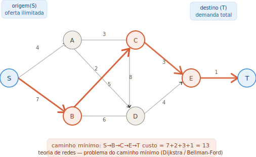
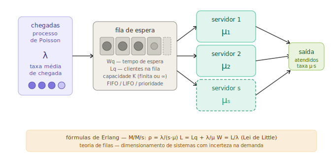

# Onboarding OTM: Pesquisa Operacional e Otimização

Este repositório contém material para alunos de computação que estão iniciando na área de pesquisa operacional. Alguns tópicos apresentados são:

  ### Programação Linear e Inteira
  

  ### Otimização em Redes e Logística
  

  ### Teoria de Filas
  
  
<i>Teoria de Filas — o modelo M/M/s conecta chegadas Poisson, fila de espera e s servidores paralelos, com as fórmulas de Erlang e a Lei de Little relacionando L, W e λ.</i>

  

## Estrutura do Repositório

### [Módulo 01: Fundamentos (Métodos Exatos)](modulo_01/)
Este módulo cobre os pilares da Pesquisa Operacional:
1.  **Aula 01**: Introdução à Programação Linear.
2.  **Aula 02**: O Problema do Caixeiro Viajante (TSP) e Programação Linear Inteira.
3.  **Aula 03**: Problemas de Transporte e Redes Logísticas.
4.  **Aula 04**: Localização de Instalações (P-Medianas e P-Hub).

### [Módulo 02: Métodos Aproximados (Heurísticas)](modulo_02/)
Focado em agilidade para problemas de larga escala:
1.  **Aula 01**: Algoritmos Gulosos.
2.  **Aula 02**: Heurísticas de Busca Local (Hill Climbing, 2-opt).
3.  **Aula 03**: Iterated Local Search (ILS).

## Pré-requisitos
- Python 3.x
- `pip install pulp matplotlib`

---
Modal - Laboratório de Modelagem Matemática e Algoritmos
