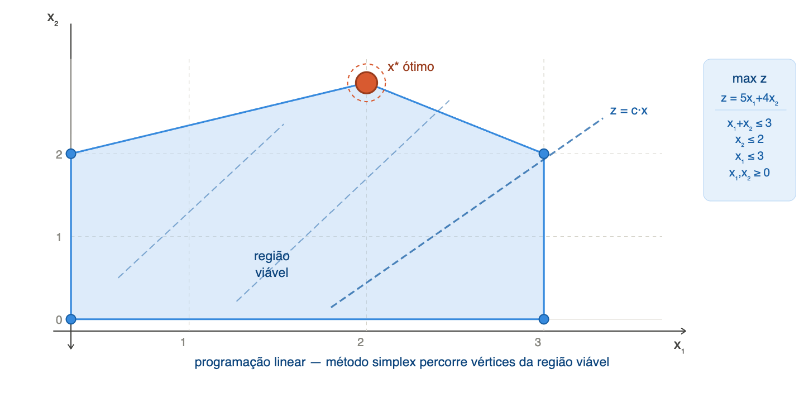
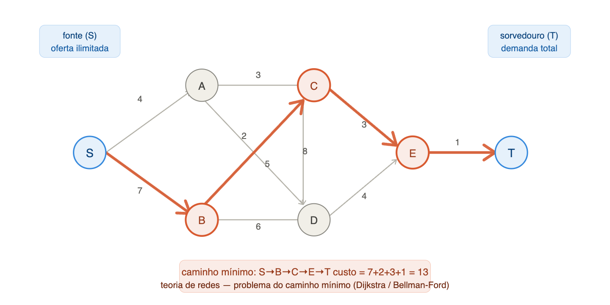

# Onboarding OTM: Pesquisa Operacional e Otimização

Este repositório contém o material de treinamento para novos membros da equipe, focado em modelagem matemática e resolução de problemas complexos usando Python e a biblioteca PuLP.

  
  

    
    
  

  
<i>Visualizações de modelos de Programação Linear e Teoria de Redes.</i>

## Estrutura do Repositório

### [Módulo 01: Fundamentos (Métodos Exatos)](modulo_01/)
Este módulo cobre os pilares da Pesquisa Operacional:
1.  **Aula 01**: Introdução à Programação Linear.
2.  **Aula 02**: O Problema do Caixeiro Viajante (TSP) e Programação Linear Inteira.
3.  **Aula 03**: Problemas de Transporte e Redes Logísticas.
4.  **Aula 04**: Localização de Instalações (P-Medianas e P-Hub).

### [Módulo 02: Métodos Aproximados (Heurísticas)](modulo_02/)
Focado em agilidade para problemas de larga escala:
1.  **Aula 01**: Algoritmos Gulosos.
2.  **Aula 02**: Heurísticas de Busca Local (Hill Climbing, 2-opt).
3.  **Aula 03**: Iterated Local Search (ILS).

## Pré-requisitos
- Python 3.x
- `pip install pulp matplotlib`

---
Equipe de Otimização - OTM
